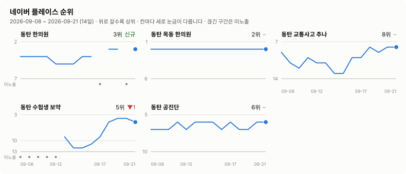
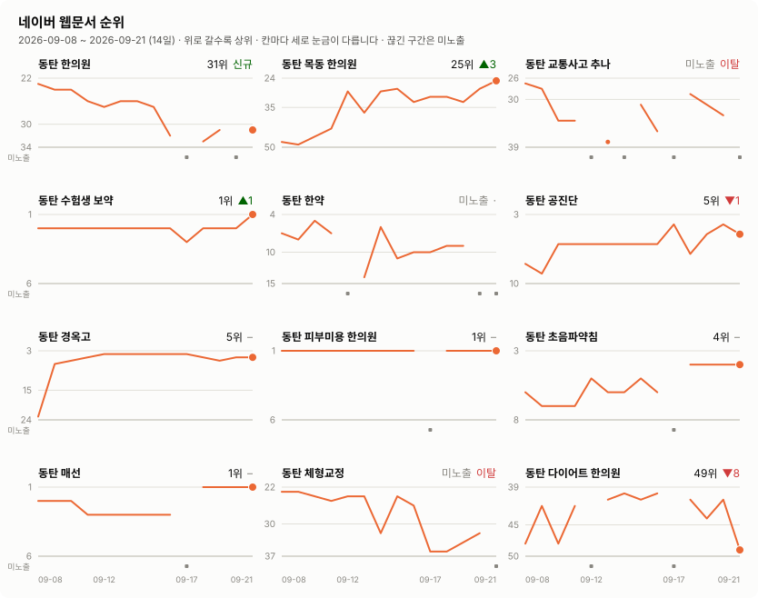

# 검색 노출 히스토리

시호한의원([thesiho.kr](https://thesiho.kr)) 의 네이버 검색 노출을 매일
아침 측정해 쌓아 둔 브랜치입니다. 측정은 main 의 `tools/seo-report.py`,
이 문서와 차트는 `render-readme.py` 가 자동으로 그립니다.

> **데이터 전용 브랜치입니다. main 에 머지하지 마세요.**
> README 와 `charts/` 는 매일 다시 쓰이므로 직접 고쳐도 다음 날 덮어써집니다.

측정 14일 · 2026-09-08 ~ 2026-09-21 · 마지막 갱신 2026-09-21 09:06 KST

## 네이버 플레이스 순위

## 네이버 웹문서 순위

## 최근 측정값 — 2026-09-21

| 키워드 | 플레이스 | 전일 | 웹문서 | 전일 |
| --- | ---: | :---: | ---: | :---: |
| 동탄 한의원 | 3위 | 신규 | 31위 · 3p | 신규 |
| 동탄 목동 한의원 | 2위 | – | 25위 · 2p | ▲3 |
| 동탄 교통사고 추나 | 8위 | – | 미노출 | 이탈 |
| 동탄 수험생 보약 | 5위 | ▼1 | 1위 · 1p | ▲1 |
| 동탄 한약 | 미노출 (14곳 중) | · | 미노출 | · |
| 동탄 공진단 | 6위 | – | 5위 · 1p | ▼1 |
| 동탄 경옥고 | 미노출 (13곳 중) | · | 5위 · 1p | – |
| 동탄 피부미용 한의원 | 미노출 (3곳 중) | · | 1위 · 1p | – |
| 동탄 초음파약침 | 미노출 (12곳 중) | · | 4위 · 1p | – |
| 동탄 매선 | 미노출 (9곳 중) | · | 1위 · 1p | – |
| 동탄 체형교정 | 미노출 (1곳 중) | · | 미노출 | 이탈 |
| 동탄 다이어트 한의원 | 미노출 (17곳 중) | · | 49위 · 4p | ▼8 |
| 초음파약침 | 미노출 (20곳 중) | · | 미노출 | · |
| 매선 | 미노출 (16곳 중) | · | 미노출 | · |
| 공진단 | 미노출 (18곳 중) | · | 미노출 | · |

## AI 크롤러 · 색인 파일

크롤러 5종(GPTBot, ClaudeBot, PerplexityBot, OAI-SearchBot, Google-Extended) 과 /llms.txt, /robots.txt, /sitemap-index.xml 모두 200 정상.

구조화 데이터 `Answer`, `FAQPage`, `MedicalClinic`, `PostalAddress`, `Question` · 사이트맵 29개 URL

## 파일

| 파일 | 내용 |
| --- | --- |
| `rank-history.jsonl` | 하루 한 줄. 측정 원본이라 **사람이 고치지 마세요** |
| `render-readme.py` | 이 README 와 `charts/*.svg` 생성기 |

차트는 최근 30일만 그립니다. 선이 끊긴 구간과 아래 띠의
점은 그날 순위에 잡히지 않았거나(미노출) 측정이 실패한 날입니다.
